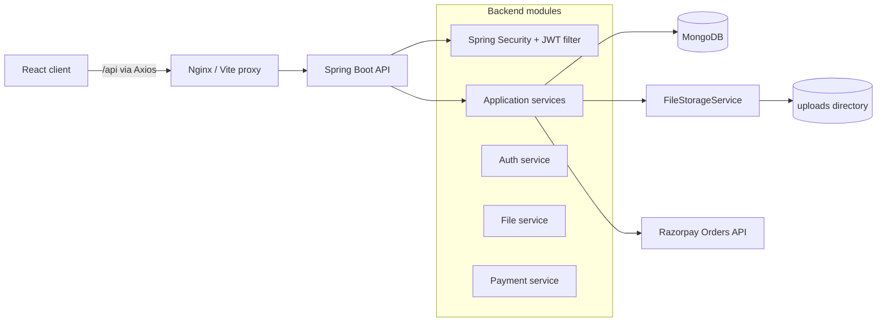

# Cloud Share — Secure File Sharing Platform

Cloud Share is a full-stack file-sharing application built with Java 21, Spring Boot, MongoDB, React, JWT authentication, local file storage, upload credits, public/private sharing, and Razorpay test-mode payments.

This repository is intentionally structured as an interview-readable project: controllers stay thin, business rules live in services, database access is isolated in repositories, API payloads use DTOs, and file storage is hidden behind an interface so a cloud storage implementation can replace local disk later.

## Current scope

Implemented:

- Account registration and login
- BCrypt password hashing
- JWT-based stateless authentication
- MongoDB persistence
- Authenticated file upload
- Plan-based upload size limits
- Atomic credit deduction per upload
- Credit refund when storage or metadata persistence fails
- Private owner downloads
- Public share links with unique tokens
- Public/private visibility switching
- File deletion
- Download counters and download event records
- Free, Premium, and Ultimate plan policies
- Razorpay order creation
- Server-side HMAC SHA-256 signature verification
- Idempotent credit application per payment ID
- React protected routes and authentication context
- Axios authentication interceptor
- Drag-and-drop uploads with progress
- File management table
- Razorpay Checkout integration
- Dockerfiles and Docker Compose
- Frontend Nginx reverse proxy

Not claimed:

- No fabricated traffic, upload, latency, or scale numbers
- Local disk storage is not horizontally scalable
- This version does not include malware scanning, object storage, email sharing, expiry links, refresh tokens, payment webhooks, or admin analytics

## Tech stack

### Backend

- Java 21
- Spring Boot 3.5.16
- Spring Web
- Spring Security
- Spring Data MongoDB
- JWT using JJWT
- BCrypt
- Bean Validation
- Razorpay Java SDK
- HMAC SHA-256
- Maven

### Frontend

- React 19
- Vite 8
- JavaScript
- React Router
- Axios
- Tailwind CSS 4
- Nginx for the production container

### Infrastructure

- MongoDB 7
- Docker
- Docker Compose
- Named Docker volumes for MongoDB data and uploaded files

## Architecture



### Request layering

```text
Controller -> DTO validation -> Service/business rules -> Repository or storage adapter
```

Controllers do not directly manipulate MongoDB documents or filesystem paths.

## Repository layout

See [PROJECT_STRUCTURE.md](PROJECT_STRUCTURE.md) for the expanded tree and [VALIDATION.md](VALIDATION.md) for the checks actually performed during generation.

```text
cloud-share-complete/
├── backend/
├── frontend/
├── scripts/
├── .env.example
├── docker-compose.yml
├── GITHUB_COMMIT_PLAN.md
├── PROJECT_STRUCTURE.md
└── README.md
```

## Database collections

### `users`

| Field | Purpose |
|---|---|
| `id` | MongoDB document ID |
| `name` | Display name |
| `email` | Unique normalized email |
| `passwordHash` | BCrypt hash; raw passwords are never stored |
| `role` | `USER` or `ADMIN` |
| `planType` | `FREE`, `PREMIUM`, or `ULTIMATE` |
| `credits` | Remaining upload credits |
| `processedPaymentIds` | Prevents the same verified payment from adding credits twice |
| `createdAt` | UTC creation timestamp |

### `files`

| Field | Purpose |
|---|---|
| `storedFileName` | Random server-side filename |
| `originalFileName` | Sanitized user-facing filename |
| `fileSize` | File size in bytes |
| `contentType` | Submitted media type |
| `ownerId` | Owning user ID |
| `visibility` | `PUBLIC` or `PRIVATE` |
| `shareToken` | Unique token only while public |
| `uploadedAt` | UTC upload timestamp |
| `downloadCount` | Total successful download requests |

### `payments`

| Field | Purpose |
|---|---|
| `userId` | Purchasing user |
| `razorpayOrderId` | Unique server-created order ID |
| `razorpayPaymentId` | Unique payment ID after verification |
| `amount` | Amount in paise |
| `currency` | `INR` |
| `planType` | Purchased plan |
| `status` | `PENDING`, `SUCCESS`, or `FAILED` |
| `createdAt` / `updatedAt` | Audit timestamps |

### `download_events`

Stores the file ID, optional user ID, download source, remote address, and timestamp. This is an audit collection, not a fabricated analytics claim.

## API endpoints

### Authentication

| Method | Endpoint | Authentication | Description |
|---|---|---:|---|
| `POST` | `/api/auth/register` | No | Register, receive JWT and profile |
| `POST` | `/api/auth/login` | No | Authenticate and receive JWT |

### User

| Method | Endpoint | Authentication | Description |
|---|---|---:|---|
| `GET` | `/api/users/me` | JWT | Current profile, plan, credits, and file limit |

### Files

| Method | Endpoint | Authentication | Description |
|---|---|---:|---|
| `POST` | `/api/files/upload` | JWT | Multipart upload; consumes one credit |
| `GET` | `/api/files` | JWT | List current user's files |
| `GET` | `/api/files/{id}/download` | JWT | Owner-only download |
| `PATCH` | `/api/files/{id}/visibility` | JWT | Set `PUBLIC` or `PRIVATE` |
| `DELETE` | `/api/files/{id}` | JWT | Delete metadata and stored file |

Upload request:

```text
Content-Type: multipart/form-data
file=<binary>
visibility=PRIVATE|PUBLIC
```

### Public sharing

| Method | Endpoint | Authentication | Description |
|---|---|---:|---|
| `GET` | `/api/share/{token}` | No | Public metadata used by the share page |
| `GET` | `/api/share/{token}/download` | No | Download a public file |

### Plans and payments

| Method | Endpoint | Authentication | Description |
|---|---|---:|---|
| `GET` | `/api/plans` | No | Read backend-controlled plan details |
| `POST` | `/api/payments/create-order` | JWT | Create a Razorpay order for a paid plan |
| `POST` | `/api/payments/verify` | JWT | Verify signature and apply plan credits |

## Plan rules

| Plan | Starting/added credits | Maximum file size | Default price |
|---|---:|---:|---:|
| Free | 10 | 10 MiB | ₹0 |
| Premium | 100 | 100 MiB | ₹499 |
| Ultimate | 500 | 500 MiB | ₹999 |

Paid plans currently behave as one-time credit packs. A successful purchase changes the active plan and adds the plan's credits. Recurring billing is not represented as implemented.

## JWT authentication flow

1. A user registers or logs in.
2. Spring Security authenticates the submitted email and password.
3. The backend creates a signed JWT containing the normalized email as the subject.
4. The frontend stores the JWT in `localStorage` for this MVP.
5. The Axios request interceptor sends `Authorization: Bearer <token>`.
6. `JwtAuthenticationFilter` verifies the signature and expiration, loads the user, and populates the Spring Security context.
7. Protected controllers use the authenticated email supplied by Spring Security, not a user ID sent by the frontend.

For a production system, consider secure same-site cookies, refresh-token rotation, token revocation, device/session management, and a stricter Content Security Policy.

## Razorpay payment flow

1. The frontend sends only the selected `planType`.
2. The backend chooses the amount from its own plan policy. It does not trust a frontend amount.
3. The backend creates a Razorpay order and stores a `PENDING` payment record.
4. The frontend opens Razorpay Checkout using the public key ID and backend-created order ID.
5. Checkout returns a payment ID, order ID, and signature.
6. The frontend sends those three values to `/api/payments/verify`.
7. The backend loads its own stored order and computes:

```text
HMAC_SHA256(stored_order_id + "|" + razorpay_payment_id, key_secret)
```

8. The backend compares signatures using `MessageDigest.isEqual`.
9. Only a valid backend verification marks the payment successful and applies credits.
10. `processedPaymentIds` makes credit application idempotent for repeated verification requests.

Production improvement: add Razorpay webhooks and verify the final captured payment state so fulfillment can recover even if the browser closes after payment.

## Security controls included

- JWT secret comes from an environment variable
- Razorpay secret stays in the backend
- BCrypt cost factor 12
- Stateless Spring Security configuration
- DTO validation
- Normalized unique email addresses
- Owner checks for private file operations
- Random stored filenames
- Normalized storage paths with traversal protection
- Unique public share tokens
- Plan-based size validation
- Server-level multipart limit
- Blocked executable extensions for the first version
- Backend-controlled plan prices
- HMAC SHA-256 payment verification
- Constant-time byte comparison for signatures
- Idempotent credit fulfillment
- `.env` ignored by Git

File extension blocking is not malware scanning. Production uploads should also be inspected by a malware scanner and validated using file signatures, not only names and MIME headers.

# Running the project

## Recommended: Docker Compose

### Prerequisites

- Docker Desktop on Windows/macOS, or Docker Engine with Compose on Linux
- Docker Desktop must be open and the Docker engine must be running
- Razorpay test credentials only if testing payments

### 1. Create the environment file

From the repository root:

**PowerShell**

```powershell
Copy-Item .env.example .env
```

**Linux/macOS**

```bash
cp .env.example .env
```

Replace `JWT_SECRET` with a long random value. Example PowerShell generator:

```powershell
[Convert]::ToBase64String((1..48 | ForEach-Object { Get-Random -Maximum 256 }))
```

Keep `.env` out of Git.

### 2. Start everything

```bash
docker compose up --build
```

Open:

- Frontend: `http://localhost:5173`
- Backend health: `http://localhost:8080/actuator/health`
- MongoDB: `localhost:27017`

### 3. Stop

```bash
docker compose down
```

To remove all database and uploaded-file volumes too:

```bash
docker compose down -v
```

That second command permanently removes local project data.

### Common Docker error on Windows

If Docker reports that it cannot connect to `dockerDesktopLinuxEngine` or a named pipe does not exist, Docker Desktop is not running or its Linux container engine has not started. Open Docker Desktop, wait until it says the engine is running, then rerun `docker compose up --build`.

## Manual development mode

### Backend requirements

- Java 21
- Maven 3.9+, or IntelliJ IDEA's bundled Maven
- MongoDB running locally on port 27017

Set environment variables before starting.

**PowerShell**

```powershell
$env:JWT_SECRET="replace-with-at-least-32-random-characters"
$env:MONGODB_URI="mongodb://localhost:27017/cloud_share"
$env:RAZORPAY_KEY_ID=""
$env:RAZORPAY_KEY_SECRET=""
cd backend
mvn spring-boot:run
```

**Linux/macOS**

```bash
export JWT_SECRET='replace-with-at-least-32-random-characters'
export MONGODB_URI='mongodb://localhost:27017/cloud_share'
cd backend
mvn spring-boot:run
```

Razorpay variables may remain empty until payment testing. The rest of the backend will still start; payment order creation will return a clear configuration error.

### Frontend requirements

- Node.js 22+
- npm

```bash
cd frontend
npm install
npm run dev
```

Vite proxies `/api` to `http://localhost:8080`, so normal local development does not require changing the frontend API URL.

## IDE setup

### VS Code

Open the repository root. This is the easiest view when working across frontend, backend, Compose, and documentation.

Recommended extensions:

- Extension Pack for Java
- Spring Boot Extension Pack
- ESLint
- Tailwind CSS IntelliSense
- Docker

### IntelliJ IDEA

Open `backend/pom.xml` as a Maven project for backend work. IntelliJ can use its bundled Maven even when `mvn` is not installed globally. Open the repository root or the `frontend` directory in VS Code for React work.

## Razorpay test setup

1. Create or open a Razorpay account.
2. Switch the Dashboard to Test Mode.
3. Copy the test key ID and test key secret.
4. Put them in `.env`:

```dotenv
RAZORPAY_KEY_ID=rzp_test_...
RAZORPAY_KEY_SECRET=...
```

5. Rebuild/restart the backend after changing environment variables.
6. Use Razorpay's test payment details, not real money.

Never add `RAZORPAY_KEY_SECRET` to React, Vite variables, source code, screenshots, commits, or GitHub Actions logs.

## Build and test commands

### Backend

```bash
cd backend
mvn clean test
mvn clean package
```

### Frontend

```bash
cd frontend
npm ci
npm run lint
npm run build
```

### Smoke test after startup

```bash
./scripts/smoke-test.sh
```

## Example API usage

### Register

```bash
curl -X POST http://localhost:8080/api/auth/register \
  -H "Content-Type: application/json" \
  -d '{"name":"Sam","email":"sam@example.com","password":"StrongPass123"}'
```

Copy the returned token:

```bash
TOKEN="paste-token-here"
```

### View profile

```bash
curl http://localhost:8080/api/users/me \
  -H "Authorization: Bearer $TOKEN"
```

### Upload

```bash
curl -X POST http://localhost:8080/api/files/upload \
  -H "Authorization: Bearer $TOKEN" \
  -F "file=@example.pdf" \
  -F "visibility=PRIVATE"
```

### Make a file public

```bash
curl -X PATCH http://localhost:8080/api/files/FILE_ID/visibility \
  -H "Authorization: Bearer $TOKEN" \
  -H "Content-Type: application/json" \
  -d '{"visibility":"PUBLIC"}'
```

## Screenshots

Add real screenshots after running the application. Suggested files:

```text
docs/screenshots/login.png
docs/screenshots/dashboard.png
docs/screenshots/my-files.png
docs/screenshots/plans.png
docs/screenshots/public-share.png
```

Do not add screenshots containing JWTs, Razorpay secrets, private files, personal email addresses, or browser developer-tool request headers.

## Future improvements

- S3, Cloudflare R2, Azure Blob Storage, or Google Cloud Storage adapter
- Expiring links and one-time downloads
- Private sharing with recipient accounts
- Refresh-token rotation and session revocation
- Email verification and password reset
- Razorpay webhooks and payment-state reconciliation
- Antivirus/malware scanning
- File-signature validation
- Encryption at rest
- Rate limiting and abuse detection
- Quotas based on bytes as well as upload count
- Pagination and search
- Background cleanup jobs
- Object-storage presigned upload/download URLs
- Audit dashboards
- Integration tests using Testcontainers
- CI pipeline for Maven tests, frontend lint/build, and container builds
- Kubernetes or managed-container deployment after storage is externalized

## GitHub workflow

Use the staged plan in [GITHUB_COMMIT_PLAN.md](GITHUB_COMMIT_PLAN.md). The plan avoids one giant “initial commit” and gives each major feature an explainable history for interviews.

## License

Add the license that matches your intended use before publishing. Do not claim third-party logos, screenshots, or code as your own.
